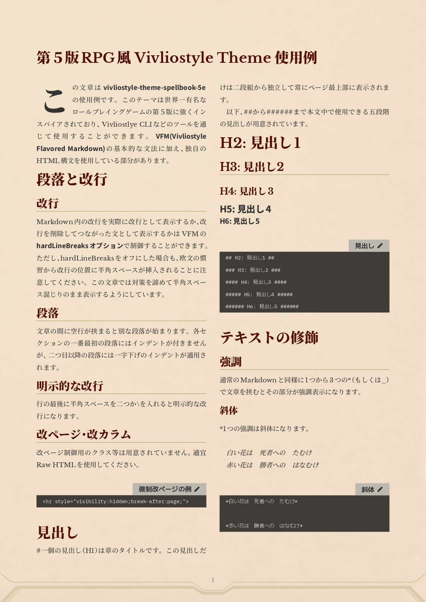

# Vivliostyle Theme Spellbook 5e

[](https://npmjs.com/package/@liarnose/vivliostyle-theme-spellbook-5e)
[](https://npmjs.com/package/@liarnose/vivliostyle-theme-spellbook-5e)


Vivliostyle Theme for 5e RPG Fanzine (Unofficial)

## Use

In `vivliostyle.config.js`:

```js
module.exports = {
  theme: '@liarnose/vivliostyle-theme-spellbook-5e'
};
```




## License
Lisenced under CC0  
[](http://creativecommons.org/publicdomain/zero/1.0/deed.ja)


## Credit
image/page.png  
[Original Photo](https://unsplash.com/photos/  white-wall-paint-with-black-shadow-3gifzboyZk0) by Unsplash / Kiwihug  
Licensed under [Unsplash License](https://unsplash.com/license)

image/marble.png  
[Original Photo](https://unsplash.com/photos/white-and-gray-abstract-painting-fcWAwPKpkTU) by Unsplash / Madison Bracaglia  
Licensed under [Unsplash License](https://unsplash.com/license)

example/dungeon_map.png  
[Original Photo](https://unsplash.com/photos/brown-bread-on-white-background-Fld_z35k-NM) by Unsplash / Dan Cristian Pădureț  
Licensed under [Unsplash License](https://unsplash.com/license)  
Map generated by [Watabou's Procgen Arcana](https://watabou.github.io/index.html)  
