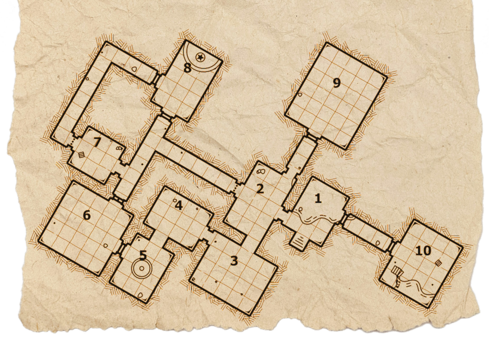

# 第５版RPG風 Vivliostyle Theme 使用例 {.sb5e-dropcap-after} #

この文章は**vivliostyle-theme-spellbook-5e**の使用例です。
このテーマは世界一有名なロールプレイングゲームの第５版に強くインスパイアされており、
Vivliostlye CLIなどのツールを通じて使用することができます。
**VFM(Vivliostyle Flavored Markdown)**の基本的な文法に加え、独自のHTML構文を使用している部分があります。

## 段落と改行 ##

### 改行 ###

Markdown内の改行を実際に改行として表示するか、改行を削除してつながった文として表示するかは
VFMの**hardLineBreaksオプション**で制御することができます。
ただし、hardLineBreaksをオフにした場合も、欧文の慣習から改行の位置に半角スペースが挿入されることに注意してください。
この文章では対策を諦めて半角スペース混じりのまま表示するようにしています。

### 段落 ###

文章の間に空行が挟まると別な段落が始まります。
各セクションの一番最初の段落にはインデントが付きませんが、
二つ目以降の段落には一字下げのインデントが適用されます。

### 明示的な改行 ###

行の最後に半角スペースを二つか\\を入れると明示的な改行になります。

### 改ページ・改カラム ###

改ページ制御用のクラス等は用意されていません。適宜Raw HTMLを使用してください。

```md:強制改ページの例
<hr style="visibility:hidden;break-after:page;">
```

## 見出し ##

\#一個の見出し（H1）は章のタイトルです。
この見出しだけは二段組から独立して常にページ最上部に表示されます。

以下、\#\#から\#\#\#\#\#\#まで本文中で使用できる五段階の見出しが用意されています。

## H2: 見出し1 ##
### H3: 見出し2 ###
#### H4: 見出し3 ####
##### H5: 見出し4 #####
###### H6: 見出し5 ######

```md:見出し
## H2: 見出し1 ##
### H3: 見出し2 ###
#### H4: 見出し3 ####
##### H5: 見出し4 #####
###### H6: 見出し5 ######
```

## テキストの修飾 ##

### 強調 ###

通常のMarkdownと同様に1つから3つの\*（もしくは\_）で文章を挟むとその部分が強調表示になります。

#### 斜体 ####

\*1つの強調は斜体になります。  

　

*白い花は　死者への　たむけ*

*赤い花は　勝者への　はなむけ*

```md:斜体
*白い花は　死者への　たむけ*

*赤い花は　勝者への　はなむけ*
```

#### 太字 ####

\*2つの強調は太いゴシック体になります。

　

**危険なダンジョン：**ド素人のゲーム・マスターは
ダンジョンの最初の部屋に**エンシェント・レッド・ドラゴン**を
配置してくるかも知れない。

```md:太字
**危険なダンジョン：**ド素人のゲーム・マスターは
ダンジョンの最初の部屋に**エンシェント・レッド・ドラゴン**を
配置してくるかも知れない。
```

#### 呪文とマジック・アイテム ####

呪文やマジック・アイテムの表記のため、\*3つの強調は斜体の明朝体になります。

　

その学者くずれのこそ泥は
***インビジビリティ***を使ってまんまと
***ポーション・オブ・ヒーリング***をせしめた。

```md:呪文とマジック・アイテム
その学者くずれのこそ泥は
***インビジビリティ***を使ってまんまと
***ポーション・オブ・ヒーリング***をせしめた。
```

### リスト ###

順序なし、順序付きいずれも使用できます。

　

- 42gp、30spが入った財布
- ***オルター・セルフ***の巻物
- シルク製のポーチに入ったオパール色の石鹸
（ポーチ込みで25gp相当）

```md:順序なしリスト
- 42gp、30spが入った財布
- ***オルター・セルフ***の巻物
- シルク製のポーチに入ったオパール色の石鹸
（ポーチ込みで25gp相当）
```

1. 鍋に樹齢百年以上の柳の樹液をカップ二杯分加える。
1. 黒焼きにしたイモリを三匹、入念に挽いてから加える。
1. 煮立てて布で濾し、封をした壺で十年間熟成させる。

```md:順序付きリスト
1. 鍋に樹齢百年以上の柳の樹液をカップ二杯分加える。
1. 黒焼きにしたイモリを三匹、入念に挽いてから加える。
1. 煮立てて布で濾し、封をした壺で十年間熟成させる。
```

### ルビ ###
VFMの拡張として\{漢字\|ルビ\}と書くことでルビを付けることができます。
ルビは本文以外の場所でも使うことができますが、ルビのスペースのぶん行間の広さが変わることに注意してください。

　

{怪光線|エルドリッチ・ブラスト}が
間抜けな{人喰鬼|オーガ}の眉間を撃ち抜いた。

```md:ルビ
{怪光線|エルドリッチ・ブラスト}が
間抜けな{人喰鬼|オーガ}の眉間を撃ち抜いた。
```

## ブロック要素 ##

### 囲み ###

\>で始まる行は通常のMarkdownでは引用の意味ですが、このテーマでは単なる囲み記事として使用します。
マークアップの意味としては誤っているため、他用途に転用する際には注意してください。

> ###### 選択ルール：おやつインスピレーション ######
> 適切なおやつを持参したプレイヤーのキャラクターは、
> インスピレーションを得た状態でセッションを開始する。
>
> 適切なおやつとは、手やテーブル、ルールブックを
> 汚さず食べることができ、おいしいものを指す。

```md:囲み
> ###### 選択ルール：おやつインスピレーション ######
> 適切なおやつを持参したプレイヤーのキャラクターは、
> インスピレーションを得た状態でセッションを開始する。
>
> 適切なおやつとは、手やテーブル、ルールブックを
> 汚さず食べることができ、おいしいものを指す。
```

### 情景 ###
\>2つで始まる、引用を二重にした行は情景描写用の囲みとして使用します。
これもマークアップの意味としては誤っていることに注意してください。

>> 裏通りの物陰には衛兵の死体が無造作に転がされていた。
>> 兜のわずかな隙間を通じて、
>> 鋭い突剣の一撃が頭部を貫いている。

```md:情景
>> 裏通りの物陰には衛兵の死体が無造作に転がされていた。
>> 兜のわずかな隙間を通じて、
>> 鋭い突剣の一撃が頭部を貫いている。
```

### 表 ###

Markdownのテーブル記法が使えます。キャプションを付ける記法が無いのでH6見出しで代用していますが、厳密には誤ったマークアップになることに注意してください。

###### ちょっとだけ気取った朝食 ######

| 1d6 | メニュー |
| :--: | :--- |
| 1 | エッグ・ベネディクト |
| 2 | クロック・ムッシュー |
| 3 | ブリオッシュとカプチーノ |
| 4 | アボカドとベーコンのトースト |
| 5 | 塩引き鮭とふうき味噌のお茶漬け |
| 6 | 鹹豆漿<br>(塩味の豆乳スープ。台湾のものが有名) |

```md:表
###### ちょっとだけ気取った朝食 ######

| 1d6 | メニュー |
| :--: | :--- |
| 1 | エッグ・ベネディクト |
| 2 | クロック・ムッシュー |
| 3 | ブリオッシュとカプチーノ |
| 4 | アボカドとベーコンのトースト |
| 5 | 塩引き鮭とふうき味噌のお茶漬け |
| 6 | 鹹豆漿<br>(塩味の豆乳スープ。台湾のものが有名) |
```

#### 二段組の表 ####
二段組の表を直接表現する記法はありませんが、
Raw HTMLを使うことで比較的シンプルに実現できます。

###### 表A： 干支の決定 ######
<div style="display:flex; column-gap:12q">

| 1d12 | 干支 |
| :--: | :--- |
| 1 | 子（ネズミ） |
| 2 | 丑（ウシ） |
| 3 | 寅（トラ） |
| 4 | 卯（ウサギ） |
| 5 | 辰（竜） |
| 6 | 巳（ヘビ） |

| 1d12 | 干支 |
| :--: | :--- |
| 7 | 午（ウマ） |
| 8 | 未（ヒツジ） |
| 9 | 申（サル） |
| 10 | 酉（トリ） |
| 11 | 戌（イヌ） |
| 12 | 亥（イノシシ） |

</div>

```md:二段組の表
###### 表A： 干支の決定 ######
<div style="display:flex; column-gap:12q;">

| 1d12 | 干支 |
| :--: | :--- |
| 1 | 子（ネズミ） |
……

| 1d12 | 干支 |
| :--: | :--- |
| 7 | 午（ウマ） |
……

</div>

```

<hr style="visibility:hidden;break-after:page;">

## HTML構文 ##

このテーマではより複雑なレイアウトを実現するため、独自のクラスを用意しています。
追加のクラスは共通して**sb5e-**で始まり、以下のようなものがあります。

### ドロップキャップ ###

H1に**.sb5e-dropcap-afterクラス**が付与されている場合、
直後の段落にはドロップキャップが適用されます。
（この文章の一番先頭、「こ」が大きくなっている部分のことです。）

```md:ドロップキャップ
# 第５版RPG風 Vivliostyle Theme {.sb5e-dropcap-after}
この文章は……
```

### クリーチャー ###
 
**.sb5e-creature**の中に一定の順番でMarkdownの要素を並べると
クリーチャー用のデータブロックになります。

<article class="sb5e-creature">

##### 司書 #####
***中型・人型生物（人間）、秩序にして中立***

---

**AC：**11\
**hp：**14(4d6)\
**移動速度：**9m(30フィート)

---

| 【筋】 | 【敏】 | 【耐】 | 【知】 | 【判】 | 【魅】 |
|:--:|:--:|:--:|:--:|:--:|:--:|
| 10（±0） | 12（+1） | 10（±0） | 18（+4） | 12（+1） | 12（+1） |

---

**セーヴ：**【知】+6、【判】+3\
**言語：**共通語、エルフ語、ドワーフ語、竜語\
**脅威度：**4(1,100XP) 

---

**呪文発動能力：**この司書は4レベルの術者である。
呪文発動能力値は【知力】である（呪文セーヴ難易度14、呪文攻撃+6）。
以下のウィザード呪文を準備している。 

初級呪文(回数無限回)：***メイジ・ハンド***、***メッセージ***、***メンディング***、***ライト***

1レベル(4回)：***アイデンティファイ***、***コンプリヘンド・ランゲージズ***、***スリープ***、***ディテクト・マジック***、***マジック・ミサイル***

2レベル(3回)：***アーケイン・ロック***、***サジェスチョン***、***ダークヴィジョン***

**秘奥の読解：** 司書は1日に3回まで、自分が手に持っている読解済みの呪文書か魔法の巻物に記載されている呪文を、
準備している呪文であるかのように発動することができる。\
一般的な司書は、***チル・タッチ***、***フォールス・ライフ***、***レイ・オブ・エンフィーブルメント***が記載されている呪文書を所持している。

###### アクション ######

**鉄板入り呪文書：** ***近接武器攻撃：***攻撃+2、間合い1.5m(5フィート)、目標1つ。 \
ヒット：3(1d6)［殴打］ダメージ。

</article>

```md:クリーチャー
<article class="sb5e-creature">

##### 司書 #####
***中型・人型生物（人間）、秩序にして中立***

---

**AC：**11\
**hp：**14(4d6)\
**移動速度：**9m(30フィート)

---

| 【筋】 | 【敏】 | 【耐】 | 【知】 | 【判】 | 【魅】 |
|:--:|:--:|:--:|:--:|:--:|:--:|
| 10（±0） | 12（+1） | 10（±0） | 18（+4） | 12（+1） | 12（+1） |

---

**セーヴ：**【知】+6、【判】+3\
**言語：**共通語、エルフ語、ドワーフ語、竜語\
**脅威度：**4(1,100XP) 

---

**呪文発動能力：**この司書は4レベルの術者である。
呪文発動能力値は【知力】である（呪文セーヴ難易度14、呪文攻撃+6）。
以下のウィザード呪文を準備している。 

初級呪文(回数無限回)：***メイジ・ハンド***、***メッセージ***、***メンディング***、***ライト***

1レベル(4回)：***アイデンティファイ***、***コンプリヘンド・ランゲージズ***、***スリープ***、***ディテクト・マジック***、***マジック・ミサイル***

2レベル(3回)：***アーケイン・ロック***、***サジェスチョン***、***ダークヴィジョン***

**秘奥の読解：** 司書は1日に3回まで、自分が手に持っている読解済みの呪文書か魔法の巻物に記載されている呪文を、
準備している呪文であるかのように発動することができる。\
一般的な司書は、***チル・タッチ***、***フォールス・ライフ***、***レイ・オブ・エンフィーブルメント***が記載されている呪文書を所持している。

###### アクション ######

**鉄板入り呪文書：** ***近接武器攻撃：***攻撃+2、間合い1.5m(5フィート)、目標1つ。 \
ヒット：3(1d6)［殴打］ダメージ。

</article>
```

### 魔法のアイテム（参考） ###

基本の記法の範囲でおおむね再現できるため、魔法のアイテムのための専用のクラスは用意していません。

呪文もほぼ同じ記法で再現可能です。

#### スタッフ・オブ・パラレル・ヘックス ####

Staff of Parallel Hex／並行する呪いのスタッフ \
***スタッフ、アンコモン（要同調；ウィザード、ウォーロック、またはクレリックのみ同調可）***\
このスタッフを手に持っている間、君は一回のアクションを使用して
このスタッフの10チャージから1つ消費することにより、
このスタッフから、***ダークネス***、***ホールド・パースン***、
または***レイ・オブ・エンフィーブルメント***を発動することができる。
これらの呪文の呪文セーヴ難易度は君自身の値を用い、
通常君が精神集中で維持できる呪文に加えて維持することができるが、
依然としてダメージなどによって途切れうる。
このスタッフは魔法のクオータースタッフとしても使用できる。

このスタッフは夜明けごとに、消費済みのチャージを(1d8＋2)回ぶん回復する。
このスタッフの最後のチャージを消費した時は、1d20をロールすること。
1が出たならば、このスタッフは魔法のものでないただのクオータースタッフになる。

```md:魔法のアイテム
#### スタッフ・オブ・パラレル・ヘックス ####

Staff of Parallel Hex／並行する呪いのスタッフ \
***スタッフ、アンコモン（要同調；ウィザード、ウォーロック、またはクレリックのみ同調可）***\
このスタッフを手に持っている間、君は一回のアクションを使用して
このスタッフの10チャージから1つ消費することにより、
このスタッフから、***ダークネス***、***ホールド・パースン***、
または***レイ・オブ・エンフィーブルメント***を発動することができる。
これらの呪文の呪文セーヴ難易度は君自身の値を用い、
通常君が精神集中で維持できる呪文に加えて維持することができるが、
依然としてダメージなどによって途切れうる。
このスタッフは魔法のクオータースタッフとしても使用できる。

このスタッフは夜明けごとに、消費済みのチャージを(1d8＋2)回ぶん回復する。
このスタッフの最後のチャージを消費した時は、1d20をロールすること。
1が出たならば、このスタッフは魔法のものでないただのクオータースタッフになる。
```

<hr style="visibility:hidden;break-after:page;">

## Raw HTMLを使う ##

Raw HTMLを使うと、HTMLとCSSで表現出来るあらゆる静的なレイアウトを実現できます。

この項では、このテーマのインスパイア元である世界一有名なロールプレイングゲームの第５版に
頻出のレイアウトをいくつか再現しましたので、参考にしてください。

### 二段抜きの要素 ###

このテーマの本文は二段組みですが、段組みを横にまたがる囲みも作ることができます。
その中では段組みが解除されてしまうので改めて手動で二段組みを設定しても良いですし、
作例のように一段組みを活かしてクラスの成長表などの大きな要素を配置することもできます。

<div style="
  column-span: all;
  float-reference: page;
  float: top;
  padding: 12q;
  margin-block-end: 24q;
  background-color: rgb(255 255 255 / .6);
  box-shadow: 0 4q 16q rgb(0 0 0 / .2);
">

###### ファーマー ######

| レベル | 習熟ボーナス | 特徴 | 作物修得数 | 作物スロット | 最大作物レベル |
| :--: | :--: | :--- | :--: | :--: | :--: |
| 1 | +2 | 作物、緑の手 | 2 | 4 | 1 |
| 2 | +2 | ファーマーの専業 | 3 | 4 | 1 |
| 3 | +2 | 得意な作物 | 4 | 5 | 1 |
| 4 | +2 | 能力値上昇 | 5 | 5 | 1 |
| 5 | +3 | 刈り取り | 5 | 6 | 2 |
| 6 | +3 | 専業由来の特徴 | 6 | 6 | 2 |
| 7 | +3 | 園芸作物 | 7 | 7 | 2 |
| 8 | +3 | 能力値上昇 | 8 | 7 | 2 |
| 9 | +4 | ― | 8 | 8 | 3 |
| 10 | +4 | ― | 9 | 8 | 3 |
| 11 | +4 | 増産 | 10 | 8 | 3 |
| 12 | +4 | 能力値上昇 | 11 | 8 | 3 |
| 13 | +5 | 刈り取り熟練 | 11 | 9 | 4 |
| 14 | +5 | 専業由来の特徴 | 12 | 9 | 4 |
| 15 | +5 | ― | 13 | 9 | 4 |
| 16 | +5 | 能力値上昇 | 14 | 9 | 4 |
| 17 | +6 | ― | 14 | 10 | 5 |
| 18 | +6 | 無限増産 | 15 | 10 | 5 |
| 19 | +6 | 能力値上昇 | 16 | 10 | 5 |
| 20 | +6 | 大いなる実り | 17 | 10 | 5 |

</div>


  ```md:二段抜きの要素の例
<div style="
  column-span: all;
  float-reference: page;
  float: top;
  padding: 12q;
  margin-block-end: 24q;
  background-color: rgb(255 255 255 / .6);
  box-shadow:  0 4q 16q rgb(0 0 0 / .2);
">

###### ファーマー ######

| レベル | 習熟ボーナス | 特徴 | 作物修得数 | 作物スロット | 最大作物レベル |
| :--: | :--: | :--- | :--: | :--: | :--: |
| 1 | +2 | 作物、緑の手 | 2 | 4 | 1 |
……
```

下記のようにすれば、二段抜きの囲みの中をさらに二段組みにすることができます。
**.sb5e-creature**に適用するとボス・クリーチャーのデータを表すのに便利です。

```md:ボスデータの例
<article class="sb5e-creature"
style="
  column-span: all;
  float-reference: page;
  float: top;
  columns: 2;
  column-fill: balance;
  column-gap: 2rem;">

##### とても強いボス #####
……
```

### イラスト・マップ ###

イラストやマップの配置もRaw HTMLを使って都度調整します。
**Page float**を活用しましょう。

<figure style="
  column-span: all;
  float-reference: page;
  float: top;
  width: calc(100% + 48q);
  height: auto;
  margin: calc(-1 * var(--vs-page--margin-top)) -24q 24q;
  text-align: center;
">
  
  <figcaption>入江の祭壇</figcaption>
</figure>

```md:マップの配置
<figure style="
  column-span: all;
  float-reference: page;
  float: top;
  width: calc(100% + 48q);
  height: auto;
  margin: calc(-1 * var(--vs-page--margin-top)) -24q 24q;
  text-align: center;
">
  
  <figcaption>入江の祭壇</figcaption>
</figure>
```

<hr style="visibility:hidden;break-after:page;">

## 備考 ##

### 印刷用途 ###

このテーマを印刷用データの作成に使うことは想定されていません。
テクスチャ素材の解像度が印刷に使えるほど高くなく、色もsRGBカラーです。
また、Vivliostyleの塗り足し・トンボ機能との相互作用も未検証になっています。

基本的にはスクリーン上で閲覧する用途のA4サイズのpdfを得るためのものと考えてください。

### ライセンス ###

このテーマ自体はCC0の下に公開されており、
中に含まれている画像素材にも継承されるべき制約・権利表記義務はありません。
このため個人利用・商業利用の別や内容に関わらずこのテーマを使って書籍データを作成することができます。

ただし、このテーマのインスパイア元である世界一有名なロールプレイングゲームの第５版の
派生作品を作成するには、適切なライセンスを遵守する必要がある点に注意してください。
この使用例もSRD5.1を利用しているため、巻末にCC-BY-4.0のライセンス表記があります。

### 表紙 ###

このテーマには表紙レイアウトの機能は備わっていません。
raw HTMLを駆使すれば実現は可能でしょうが、
別途作成したものをvivliostyle.config.jsのエントリーに追加するか、
後から組み合わせることをおすすめします。